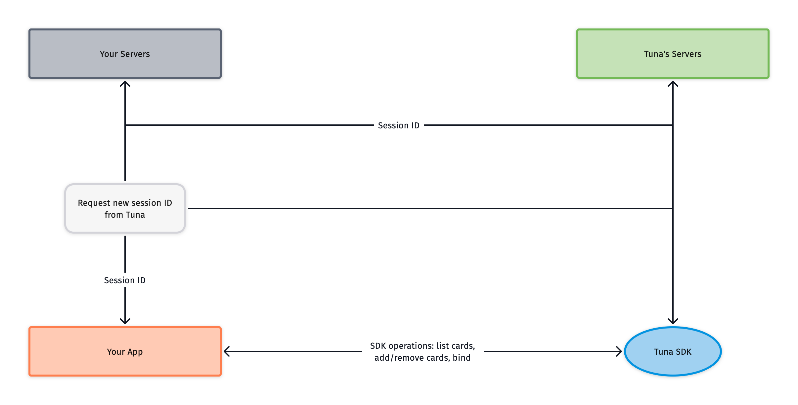

# Tuna Android SDK
A powerful and flexible SDK to easily connect with any Android App

This is the reference for the Android Tuna SDKs. You will find all details needed to configure and use the TUNA SDKs in your Android App. 
You can use our Android SDK to tokenize customer information, collect sensitive card data. 

## Get Started

### Configuration
Add `tuna` to your `build.gradle` dependencies.

```
repositories {
    maven {
        url = uri("https://maven.pkg.github.com/tuna-software/android-sdk")
    }
}

dependencies {
    implementation 'com.tunasoftware:tuna-android:<version>'
    //for kotlin extensions
    implementation 'com.tunasoftware:tunakt:<version>'
}
```

### Init the SDK

In your Application Class

```
import com.tunasoftware.tuna.entities.TunaAPIKey

class YourApplication : Application(){

    override fun onCreate() {
        super.onCreate()
        Tuna.init("<your app token>", "<your account token>")
    }
}
```

For using the sandbox

```
import com.tunasoftware.tuna.entities.TunaAPIKey

class YourApplication : Application(){

    override fun onCreate() {
        super.onCreate()
        Tuna.init("a3823a59-66bb-49e2-95eb-b47c447ec7a7", "demo", sandbox = true)
    }
}
```

### Tuna session

Every interaction with the Tuna APIs happens within a session. You must provide a session ID obtained from Tuna in order to initialize the SDK. For security reasons, this session ID must be negotiated between your own server and Tuna's servers.

Here's what initializing a session looks like:

- Your app sends a request to your own backend
- Your backend talks to Tuna's servers, to generate a new session ID for the customer
- Tuna's servers send the newly generated session ID to your own backend
- Your backend responds to your app with the new session ID
- Your app calls the Tuna SDK in order to set the current session ID



Starting the session doesn't have to be done on app launch. For example, a good place to start the session would be when the customer enters your checkout flow.

#### Java

```
import com.tunasoftware.tuna.Tuna;

...
String sessionId = getSessionIdFromBackend();
Tuna tunaSession = Tuna.startSession(sessionId);

```      

#### Kotlin

```
import com.tunasoftware.tuna.Tuna
...
val sessionId = getSessionIdFromBackend()
val tunaSession = Tuna.startSession(sessionId)

```

### Session in Sandbox

If you want to test our sdk in sandbox you can start a session without calling your backend.

#### Java

```
Tuna.getSandboxSessionId(new Tuna.TunaRequestCallback<String>() {
        @Override
        public void onSuccess(String sessionId) {
            // start the sdk session with this session id
        }

        @Override
        public void onFailed(@NotNull Throwable e) {
            Log.e(LOG, "Error getting sandbox session", e);
        }
    });
```

#### Kotlin

```
Tuna.getSandboxSessionId()
    .onSuccess { sessionId ->
         // start the sdk session with this session id
    }.onFailure {
         Log.e(LOG, "Error getting sandbox session", e)
    }
```


### Creating your first card

For creating a TunaCard you should use the session returned by the startSession method and use the method ```addNewCard```. 

You can decide whether to pass the CVV parameter or not.
The CVV should be used for creating a card that is going to be used immediately. 
If the card is going to be used later you will need to call another method named ```bind```. 
If you want to generate a **single use card** you can use set the parameter **save** to **false** into the ```addNewCard``` method.

#### Java

##### without CVV

```
tunaSession.addNewCard(number, cardHolderName, expirationMonth, expirationYear, 
                new Tuna.TunaRequestCallback<TunaCard>() {
                    @Override
                    public void onSuccess(TunaCard card) {
                        //Here is your tuna card
                    }

                    @Override
                    public void onFailed(@NotNull Throwable e) {
                        //it fails, you should handle this exception
                    }
                });
```

or, for single use card

```
tunaSession.addNewCard(number, cardHolderName, expirationMonth, expirationYear, false, 
                new Tuna.TunaRequestCallback<TunaCard>() {
                    @Override
                    public void onSuccess(TunaCard card) {
                        //Here is your tuna card
                    }

                    @Override
                    public void onFailed(@NotNull Throwable e) {
                        //it fails, you should handle this exception
                    }
                });
```


##### with CVV

```
tunaSession.addNewCard(number, cardHolderName, expirationMonth, expirationYear, cvv 
                new Tuna.TunaRequestCallback<TunaCard>() {
                    @Override
                    public void onSuccess(TunaCard card) {
                        //Here is your tuna card
                    }

                    @Override
                    public void onFailed(@NotNull Throwable e) {
                        //it fails, you should handle this exception
                    }
                });
```

or, for single use card

```
tunaSession.addNewCard(number, cardHolderName, expirationMonth, expirationYear, cvv, false, 
                new Tuna.TunaRequestCallback<TunaCard>() {
                    @Override
                    public void onSuccess(TunaCard card) {
                        //Here is your tuna card
                    }

                    @Override
                    public void onFailed(@NotNull Throwable e) {
                        //it fails, you should handle this exception
                    }
                });
```


#### Kotlin

##### without CVV

```
tunaSession.addNewCard(cardNumber = number,
                cardHolderName = cardHolderName,
                expirationMonth = month,
                expirationYear = year)
                .onSuccess { tunaCard ->  
                     //Here is your tuna card   
                }
                .onFailure { error->
                    //it fails, you should handle this exception
                }
```

or, for single use card
   
```
tunaSession.addNewCard(cardNumber = number,
                cardHolderName = cardHolderName,
                expirationMonth = month,
                expirationYear = year,
                save = false)
                .onSuccess { tunaCard ->  
                     //Here is your tuna card   
                }
                .onFailure { error->
                    //it fails, you should handle this exception
                }
```

##### with CVV

```
tunaSession.addNewCard(cardNumber = number,
                cardHolderName = cardHolderName,
                expirationMonth = month,
                expirationYear = year,
                cvv = "000")
                .onSuccess { tunaCard ->  
                     //Here is your tuna card   
                }
                .onFailure { error->
                    //it fails, you should handle this exception
                }
```

or, for single use card

```
tunaSession.addNewCard(cardNumber = number,
                cardHolderName = cardHolderName,
                expirationMonth = month,
                expirationYear = year,
                cvv = "000",
                save = false)
                .onSuccess { tunaCard ->  
                     //Here is your tuna card   
                }
                .onFailure { error->
                    //it fails, you should handle this exception
                }
```

### Binding a card with CVV

#### Java

```
tunaSession.bind(card, cvv, new Tuna.TunaRequestCallback<TunaCard>() {
            @Override
            public void onSuccess(TunaCard result) {
                  //your card is ready to be used for an actual purchase
            }

            @Override
            public void onFailed(@NotNull Throwable e) {
                   //it fails, you should handle this exception
            }
        });
```


#### Kotlin

```
tunaSession.bind(card = card, cvv = cvv)
                .onSuccess { card ->
                    //your card is ready to be used for an actual purchase
                }
                .onFailure {
                    //it fails, you should handle this exception
                }
``` 

### Getting the list of saved cards

#### Java

```
tunaSession.getCardList(new Tuna.TunaRequestCallback<List<TunaCard>>() {
            @Override
            public void onSuccess(List<TunaCard> result) {
                //those are your cards, don't forget to bind them before using them
            }

            @Override
            public void onFailed(@NotNull Throwable e) {
                //it fails, you should handle this exception
            }
        });
```

#### Koltin

```
tunaSession.getCardList()
            .onSuccess { cards ->
               //those are your cards, don't forget to bind them before using them
            }
            .onFailure { error ->
               //it fails, you should handle this exception  
            }
```

### Removing a card

#### Java

```
tunaSession.deleteCard(card, new Tuna.TunaRequestCallback<Boolean>() {
            @Override
            public void onSuccess(Boolean result) {
                //Card removed
            }

            @Override
            public void onFailed(@NotNull Throwable e) {
                //it fails, you should handle this exception  
            }
        });
```

or if you only have the token

```
tunaSession.deleteCard("<card token>", new Tuna.TunaRequestCallback<Boolean>() {
            @Override
            public void onSuccess(Boolean result) {
                //Card removed
            }

            @Override
            public void onFailed(@NotNull Throwable e) {
                //it fails, you should handle this exception  
            }
        });
```

#### Kotlin

```
tunaSession.deleteCard(card = card)
                .onSuccess {
                    //Card removed
                }
                .onFailure {
                    //it fails, you should handle this exception  
                }
```

or if you only have the token

```
tunaSession.deleteCard(token = "<card token>")
                .onSuccess {
                    //Card removed
                }
                .onFailure {
                    //it fails, you should handle this exception  
                }
```

### Getting Avaliable Payment Methods

#### Java

```
tunaSession.getPaymentMethods(new Tuna.TunaRequestCallback<List<TunaPaymentMethod>>() {
            @Override
            public void onSuccess(List<TunaPaymentMethod> result) {
                for (TunaPaymentMethod paymentMethod : result ){
                    switch (paymentMethod.getType()){
                        case CREDIT_CARD:
                            Log.i(LOG_TAG, "Credit card");
                            TunaCardPaymentMethod cardPaymentMethod = (TunaCardPaymentMethod) paymentMethod;
                            for (String brand : cardPaymentMethod.getBrands()){
                                Log.i(LOG_TAG, "Brand:"+brand);
                            }
                            break;
                        case BANK_SLIP:
                            Log.i(LOG_TAG, "Bank Slip");
                            break;
                    }
                }
            }

            @Override
            public void onFailed(@NonNull Throwable e) {
                //Failed to get payment methods
            }
        });
```

#### Kotlin

```
tunaSession.getPaymentMethods()
        .onSuccess { result ->
            for (paymentMethod in result) {
                when (paymentMethod.type) {
                    TunaPaymentMethodType.CREDIT_CARD -> {
                        Log.i(Extras.LOG_TAG, "Credit card")
                        val cardPaymentMethod = paymentMethod as TunaCardPaymentMethod
                        for (brand in cardPaymentMethod.brands) {
                            Log.i(
                                Extras.LOG_TAG,
                                "Brand:$brand"
                            )
                        }
                    }
                    TunaPaymentMethodType.BANK_SLIP -> Log.i(Extras.LOG_TAG, "Bank Slip")
                }
            }
        }
        .onFailure { error ->
            //Failed to get payment methods
       }
```


